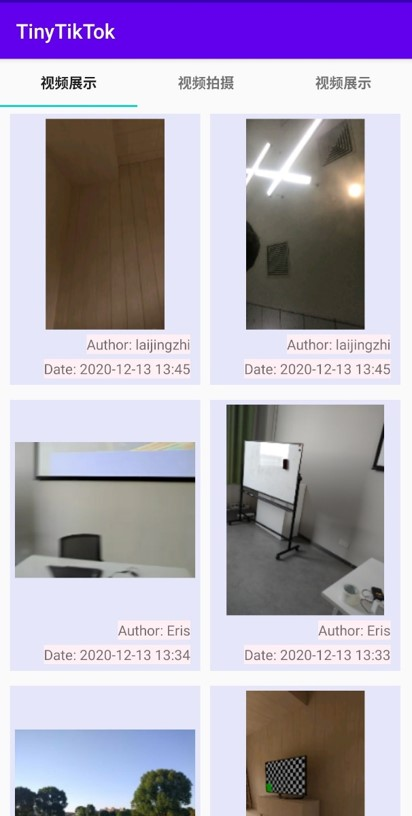

# Final Project: TinyTikTok
开发一个短视频App (迷你抖音)  

## 基本页面：  
+ 开屏页面
    + 使用Handler机制，实现允许跳过的开屏广告展示
    

        
    

+ 视频展示
    + 使用 ViewPager 和 TabLayout 实现带有 Tab 的可滑动页面
    + 使用 RecyclerView 实现视频列表的展示
    + 使用 Glide 加载封面图
    + 使用 Retrofit 实现网络请求接口
    

        
    

+ 视频播放
    + 使用 SurfaceView 和 SurfaceHolder实现视频的展示
    + 重写 oneClick() 函数，实现单击暂停/播放功能
    + 重写 doubleClick() 函数，使用 AnimatorSet 实现双击点赞动画
    

        
    

+ 视频拍摄
    + 申请系统权限
    + 使用 Camera 拍摄照片
    + 使用 MediaRecorder 录制视频
    + 使用 ContentResolver 实现数据共享将图片和视频保存到图库
    + 使用 sendBroadcast 函数实现图库扫描更新
    

        
    

+ 视频上传
    + ContentResolver 和 MediaStore 实现本地图片和视频的选择
    + ImageView 和 VideoView 展示所选择的封面图和视频
    + 使用 Retrofit 实现网络请求接口
    

        
    

