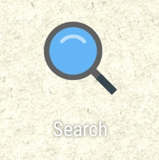
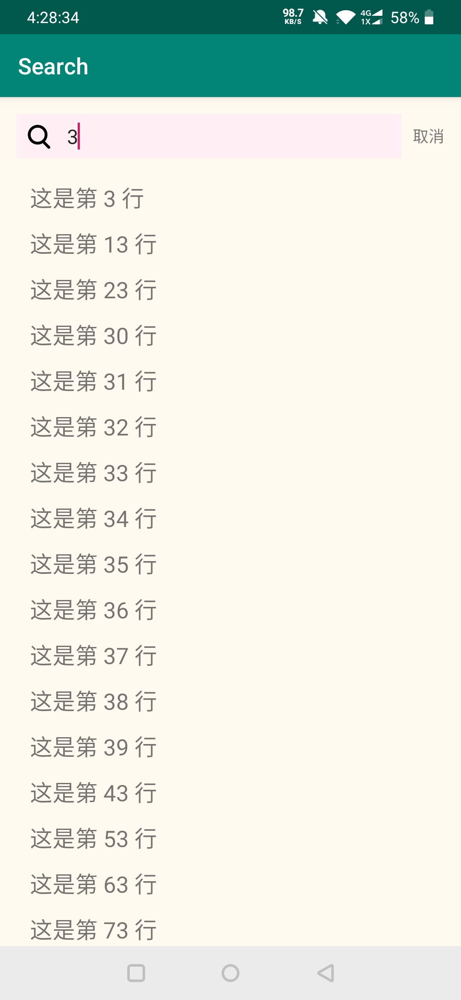
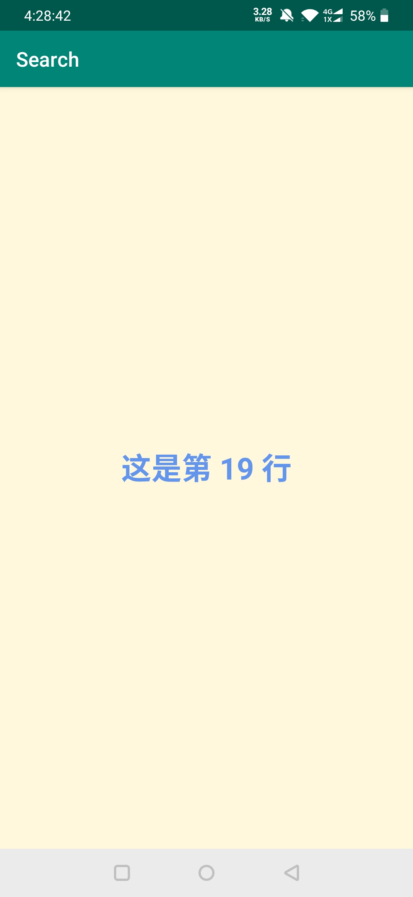

# Project 2: Search App
在这一章节，实现了一个带搜索功能的列表行的安卓App，包括基本的UI组件和Recycler列表。 

## 文件说明
+ Chapter文件夹：包括所有源代码和资源文件
+ search.apk：打包完成的Android安装包

## 效果展示
将search.apk进行真机安装测试，得到以下的屏幕截图。

+ 程序图标

    

+ 主页/登录页

    

+ 搜索功能实现

    

+ 搜索内容页面

    

