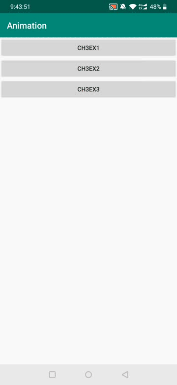
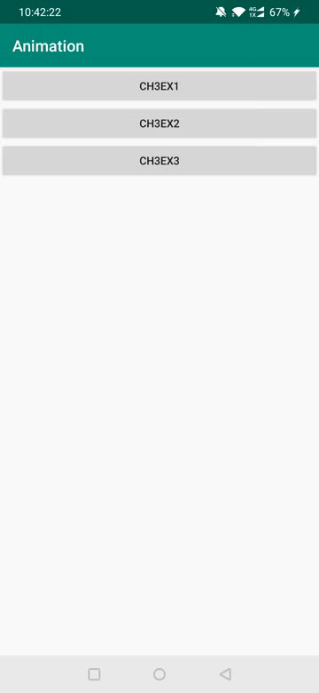
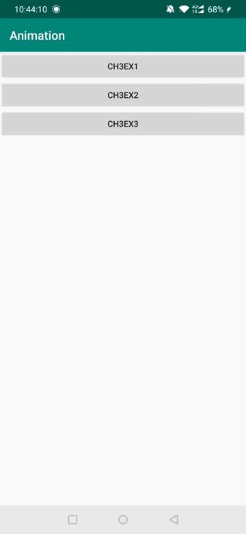

# Project 3: Animation Exercises
在本次作业中，练习了安卓开发中的Fragment和Animation的内容，实现了一个带有动画的App。

## 文件说明
+ Homework文件夹：包括所有源代码和资源文件
+ Animation.apk：打包完成的Android安装包

## 作业要求
+ EX 1: 实现自动播放 lottie 动画和进度条控制 lottie 动画。
+ EX 2: 使用 AnimatorSet 完成scale, alpha等属性动画。
+ EX 3: 使用 TabLayout 和 ViewPager 实现一个可左右滑动的好友列表界面。同时支持 Lottie 动画的淡入和列表数据的淡入。

## 效果展示
+ EX 1

    

+ EX 2

    

+ EX 3

    

