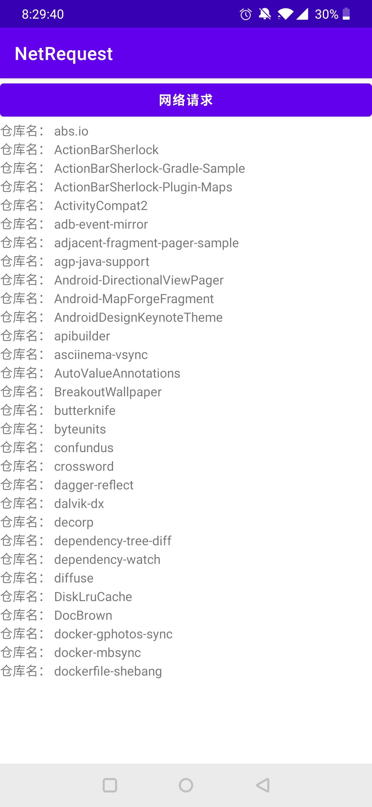

# Project 5: Network
完成一个能够访问 Restful API 网络接口的 APP，通过 github API 获取 Android ⼀哥 Jake Wharton 所有的仓库名并显示。

## 文件说明
+ Chapter5文件夹：包括所有源代码和资源文件
+ NetRequest.apk：打包完成的Android安装包

## 效果展示  

+ 网络请求

    

