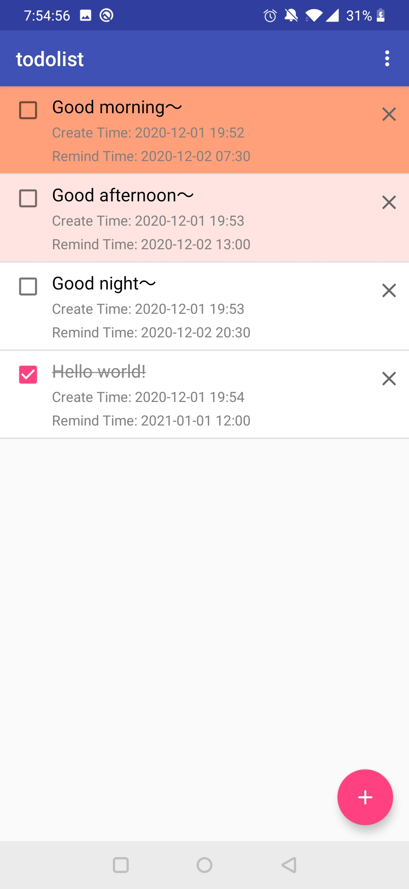
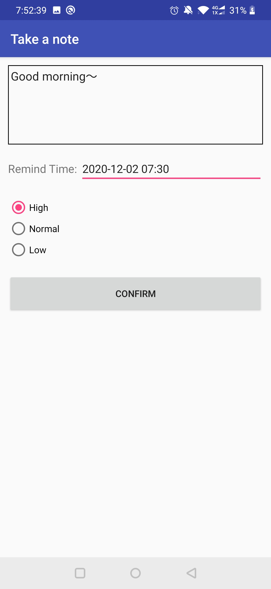
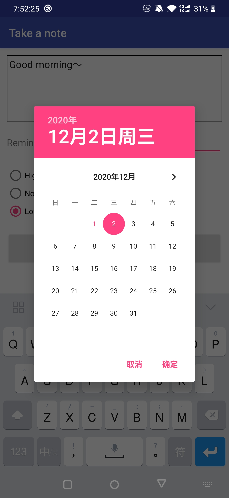
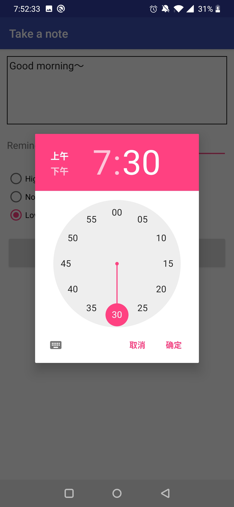
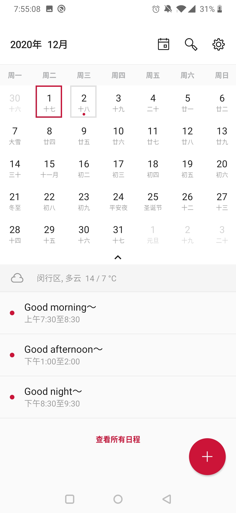

# Project 5: ToDoList App
在这一章节，利用数据库和Android存储等知识，实现了一个To-do List App。  
该应用程序有两个页面：待办事项列表页面和增加待办事项页面。前者展示数据库中查询出所有的数据，并以列表形式呈现出来；后者进行添加待办事项的操作，需要添加事件的内容、提醒时间、优先级等属性。在完成添加事件时，根据设置的提醒时间将该事件加入日历，利用系统程序完成事件提醒功能。在列表主页，显示代办事项的基本信息，可以进行设置已完成、删除等操作。

## 文件说明
+ todolist文件夹：包括所有源代码和资源文件
+ ToDoList.apk：打包完成的Android安装包

## 效果展示
将ToDoList.apk进行真机安装测试，得到以下的屏幕截图。

### 注意：该应用涉及对内存和日历的读写操作，所以应打开相应的系统权限。  

+ 待办事项列表页面

    

+ 增加待办事项页面

    

+ 为代办事项设置提醒时间

    
    

+ 检查系统应用日历，可以看到待办事项已添加至日历

    

